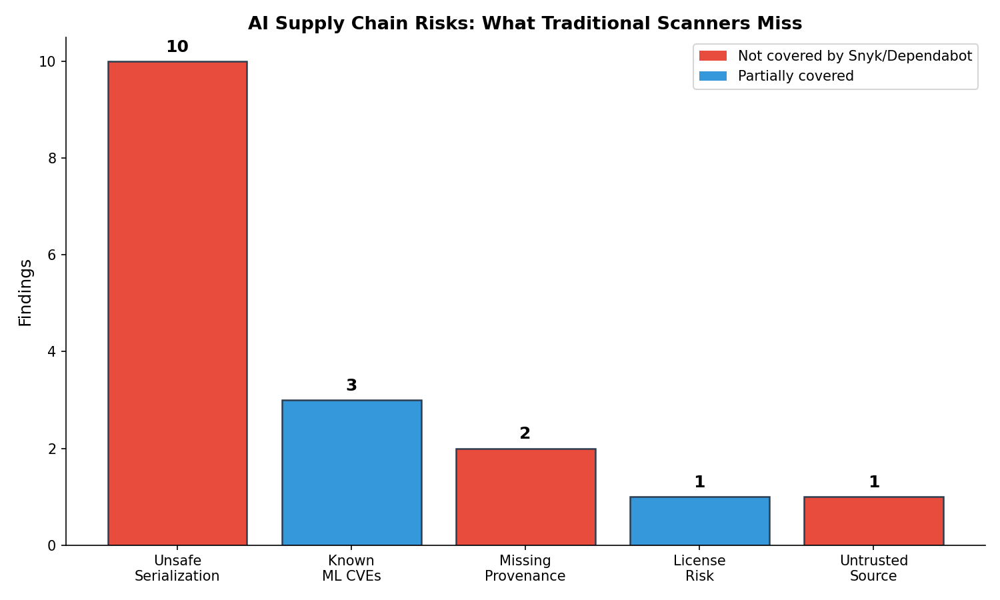
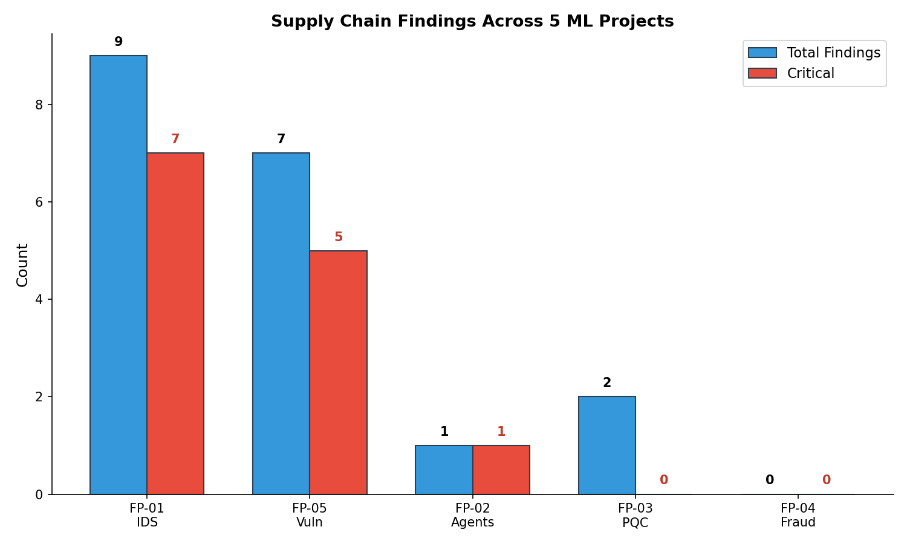
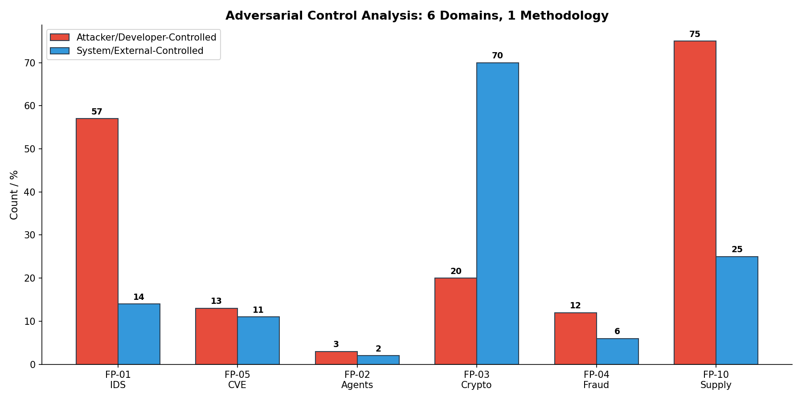

# I Built the Snyk for AI Models: Here's What Your ML Pipeline Is Hiding

I scanned 5 of my own ML projects for AI supply chain risks. Found 20 findings — 13 critical. The #1 risk isn't a sophisticated model poisoning attack. It's `pickle.load`. Half of all findings are unsafe serialization that gives attackers arbitrary code execution when you load a model. And traditional scanners (Snyk, Dependabot) don't check for it.

## Why AI Needs Its Own Supply Chain Scanner

Snyk scans your `package.json`. Dependabot watches your `requirements.txt`. But neither scans your ML models. When you `pip install transformers` and download a model from Hugging Face, you're running code from an unverified stranger on the internet — and there's no scanner telling you that.

The AI supply chain has 4 risk categories that traditional tools miss entirely:



1. **Unsafe serialization** (pickle, joblib, torch.load) — arbitrary code execution on model load
2. **Missing model provenance** — no documentation of training data, methodology, or limitations
3. **Untrusted model sources** — Hugging Face has no mandatory identity verification
4. **Deprecated ML algorithms** — known-insecure patterns in ML code

## What I Built

[ai-supply-chain-scanner](https://github.com/rexcoleman/ai-supply-chain-scanner) scans two attack surfaces:

**Dependencies:** Checks your ML project's packages against known CVEs, detects unsafe serialization patterns in your code, flags stale/deprecated libraries.

```bash
ai-supply-scan check --repo ~/my-ml-project
```

**Models:** Checks Hugging Face models for provenance gaps, unsafe serialization formats (pickle vs safetensors), license risks, and untrusted sources.

```bash
ai-supply-scan model --id bert-base-uncased
```

## What I Found

### My Own Projects Are Full of Pickle



4 of 5 projects have supply chain findings. The worst offenders use scikit-learn models saved with joblib/pickle — which is the default serialization method. Every `joblib.dump(model, 'model.pkl')` creates an arbitrary code execution vector.

**The irony:** I built these projects with govML governance — 10 templates, DECISION_LOG, ADVERSARIAL_EVALUATION. None of that governance catches `pickle.load` because it's not an experiment design issue. It's a supply chain issue.

### 65% of Findings Are CRITICAL

Not "medium" or "informational." CRITICAL. Because `pickle.load` on an untrusted file = arbitrary code execution. There's no sandbox, no validation, no defense. If an attacker replaces your `.pkl` file, they own your machine.

### Controllability: 75% Is Developer-Fixable

Applying controllability analysis (6th domain validation):

| Controllability | % | Action |
|---|---|---|
| Developer-controlled | 75% | Replace pickle with safetensors, update torch.load, pin versions |
| Model-controlled | 20% | Choose models with safetensors format |
| Platform-controlled | 5% | Report to Hugging Face |

Unlike crypto migration (FP-03, 70% library-controlled) or fraud detection (FP-04, system-dependent), supply chain risks are mostly in YOUR code. You can fix 75% of them today.



## The Fix Is Simple

For most findings, the remediation is one line:

```python
# BEFORE (CRITICAL — arbitrary code execution)
model = pickle.load(open("model.pkl", "rb"))
model = joblib.load("model.pkl")
model = torch.load("model.pt")

# AFTER (safe)
from safetensors.torch import load_model
load_model(model, "model.safetensors")
model = torch.load("model.pt", weights_only=True)
```

For Hugging Face models: prefer `.safetensors` format over `.bin` or `.pkl`. If safetensors isn't available, that's a finding.

## What I Learned

**The biggest risk is the most boring one.** Model poisoning, adversarial backdoors, training data contamination — these are the exciting supply chain attacks. But `pickle.load` is the one that'll actually get you. It's the SQL injection of ML.

**Governance doesn't cover supply chain.** govML (my governance framework) governs experiment design, data splits, and reproducibility. It doesn't scan dependencies. FP-10 fills that gap — and maybe it should become a govML generator.

**Controllability analysis keeps transferring.** 6 domains now. The principle holds: who controls the input determines what defense is possible.

The scanner is open source: [ai-supply-chain-scanner on GitHub](https://github.com/rexcoleman/ai-supply-chain-scanner). Built with [govML](https://github.com/rexcoleman/govML) v2.5.

---

*Rex Coleman is an MS Computer Science student (Machine Learning) at Georgia Tech, building at the intersection of AI security and ML systems engineering. Previously 15 years in cybersecurity (FireEye/Mandiant — analytics, enterprise sales, cross-functional leadership). CFA charterholder. Creator of [govML](https://github.com/rexcoleman/govML).*
